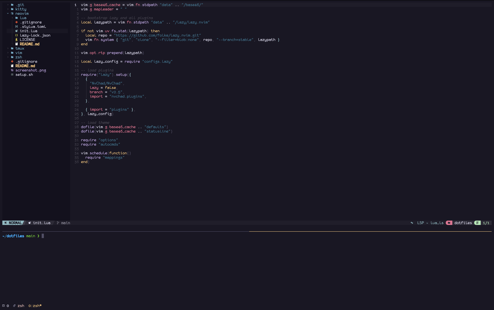

# 🧙‍♂️ My Dotfiles

This repo contains my personal setup for:

## 🐱 Kitty

```
cp kitty/* ~/.config/kitty/
```

## 🧩 Tmux

```
cp tmux/.tmux.conf ~
```

## 🐚 ZSH

Follow the `zsh/README.md`.

## ✨ Neovim

```
cp -r neovim/* ~/.config/nvim/
```

## 🔤 Fonts

- [FiraCode Nerd Font](https://github.com/ryanoasis/nerd-fonts/tree/master/patched-fonts/FiraCode)
- [Monaspice Nerd Font](https://github.com/ryanoasis/nerd-fonts/tree/master/patched-fonts/Monaspace)

## 🚀 Install

With `curl`:

```
curl -fsSL https://raw.githubusercontent.com/vuchuc789/dotfiles/main/setup.sh | bash
```

or with `wget`:

```
wget -qO- https://raw.githubusercontent.com/vuchuc789/dotfiles/main/setup.sh | bash
```

## 📸 Screenshot


