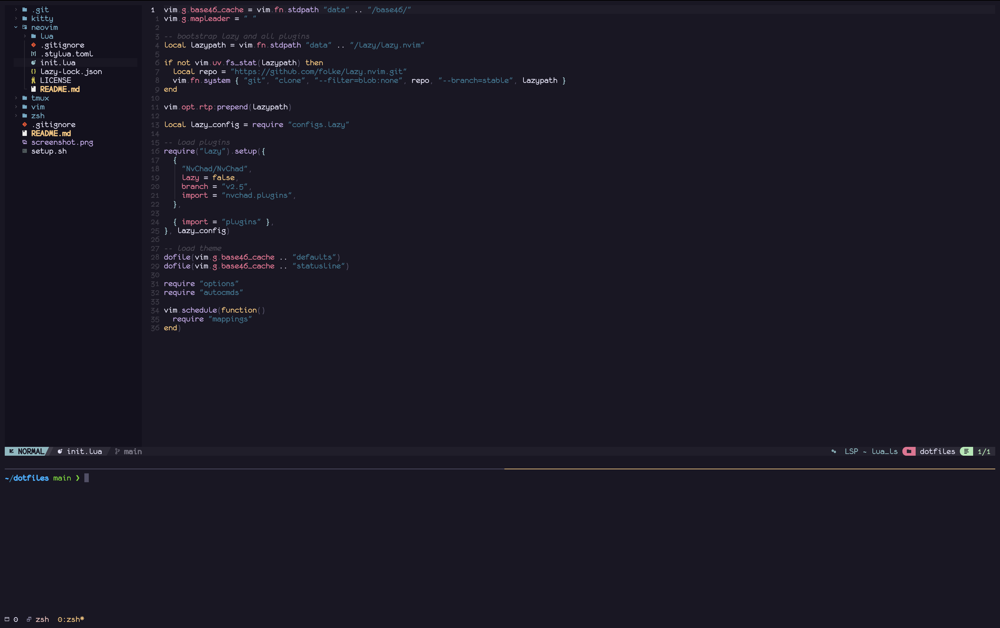

# 🧙‍♂️ My Dotfiles

This repo contains my personal setup for:

## 🐱 Kitty

```
cp kitty/* ~/.config/kitty/
```

## 🧩 Tmux

```
cp tmux/.tmux.conf ~
```

## 🐚 ZSH

Follow the `zsh/README.md`.

## ✨ Neovim

```
cp -r neovim/* ~/.config/nvim/
```

## 📝 Vim

A portable Vim config for servers.

```
cp vim/.vimrc ~
```

Install with `curl`:

```
curl -fsSL https://raw.githubusercontent.com/vuchuc789/dotfiles/main/vim/.vimrc -o ~/.vimrc
```

or with `wget`:

```
wget -qO ~/.vimrc https://raw.githubusercontent.com/vuchuc789/dotfiles/main/vim/.vimrc
```

## 🎨 Colorschemes

- [Tokionight](https://github.com/folke/tokyonight.nvim)
- [Catppuccin](https://github.com/catppuccin/catppuccin)
- [Rosé Pine](https://rosepinetheme.com/themes/)

## 🔤 Fonts

- FiraCode Nerd Font
- Monaspice Nerd Font
- Monofur Nerd Font

> Download fonts [here](https://www.nerdfonts.com/font-downloads).

## 🚀 Quick Install

With `curl`:

```
curl -fsSL https://raw.githubusercontent.com/vuchuc789/dotfiles/main/setup.sh | bash
```

or with `wget`:

```
wget -qO- https://raw.githubusercontent.com/vuchuc789/dotfiles/main/setup.sh | bash
```

## 📸 Screenshot


